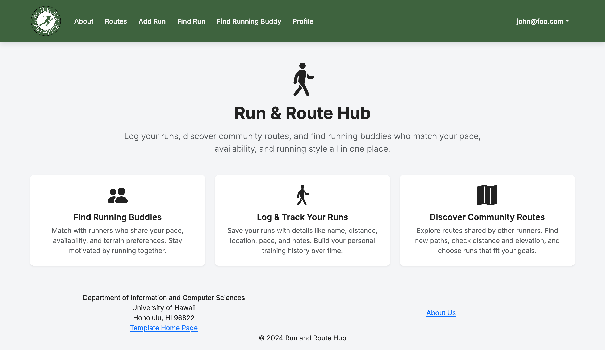
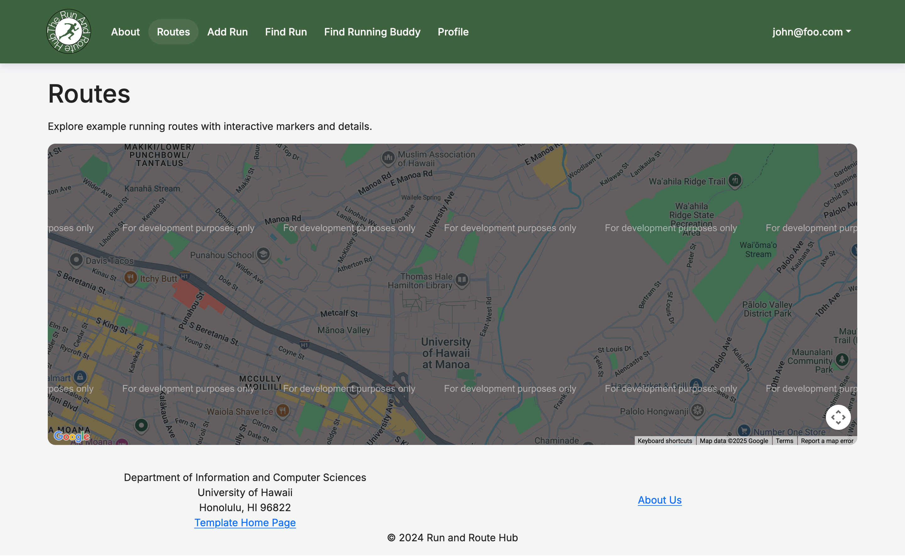
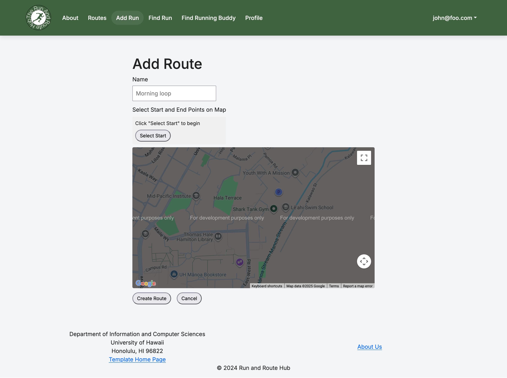
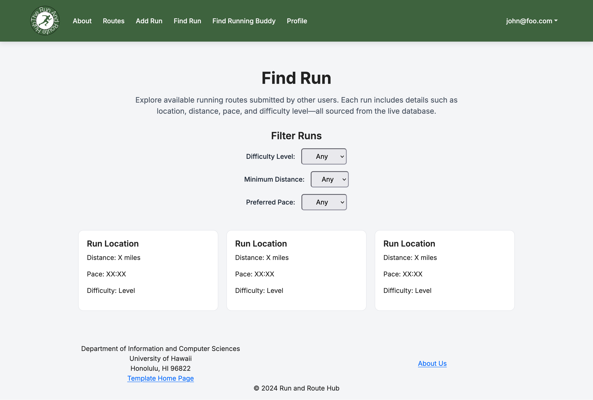
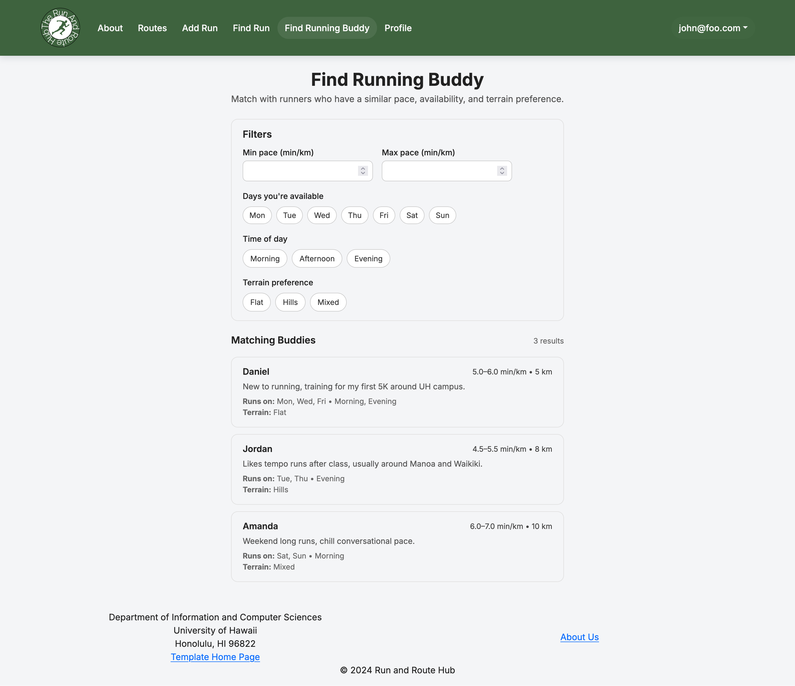
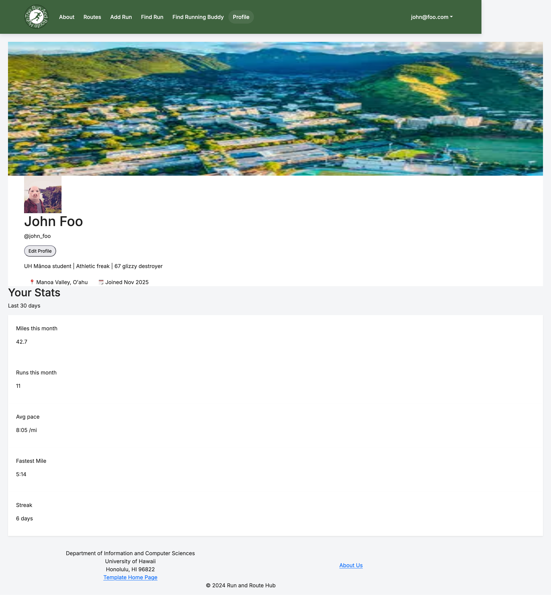

# Run & Route Hub

## Table of contents

* [Overview](#Overview)
* [Deployment](#Deployment)
* [Development](#Development)
* [Team](#Team)

## Overview

**Run & Route Hub** is a running-focused web app for UH students that helps runners:

- Find running partners based on pace and availability
- Access safe & UH-verified running routes
- Log runs and track progress
- View route difficulty scores (heat, slope, humidity, distance)
- Share safety feedback (lighting, crowds, sidewalks, water fountains)

This creates a **motivating and safety-focused running community** built specifically for UH students.

## Deployment

Project has been deployed to [Vercel](https://run-and-route-hub.vercel.app/).

## Development

This is our landing page, featuring our purpose in the center with multiple text blocks beneath it going into detail about the different features we have.

### Milestone 1
[Milestone 1](https://github.com/orgs/run-and-route-hub/projects/1/views/1) contains the plans and issues worked on during the initial stages of the project.

### Milestone 2
[Milestone 2](https://github.com/orgs/run-and-route-hub/projects/4/views/1) contains the plans and issues worked on during the second section of our project.

## Team

[Team Contract](https://docs.google.com/document/u/1/d/1DqhWxR_jaalQ27gvdDZRM-GbxYIpypTjjWOkkhnjlBU/edit?tab=t.0)

- [Renjie Chen](https://chenr24-ics.github.io/)
- [Albert Scales](https://albertlks.github.io/)
- [Shuwei Chen](https://shuwei0225.github.io/)
- [Jacob Hatanaka](https://jacob-hatanaka.github.io/)
- [Preston Woo](https://preston-woo.github.io/)
