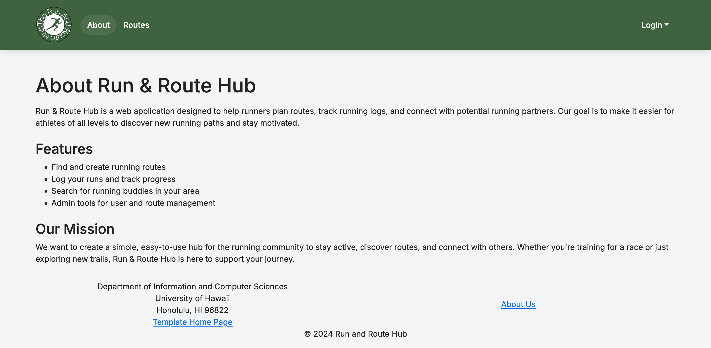
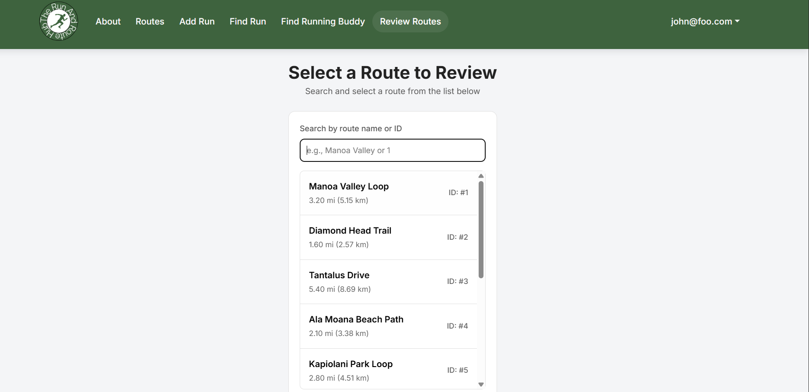
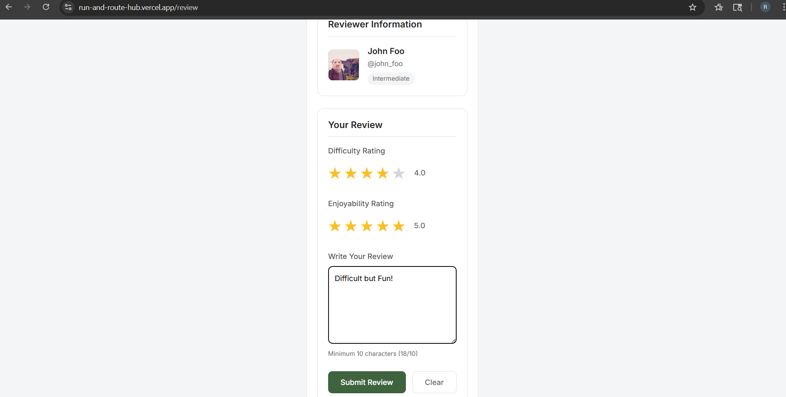

# Run & Route Hub
[](https://github.com/run-and-route-hub/Run-and-Route-Hub/actions/workflows/ci.yml)

## Table of contents

* [Overview](#overview)
* [Deployment](#deployment)
* [User Guide](#user-guide)
* [Developer Guide](#developer-guide)
* [Milestone 1](#milestone-1)
* [Milestone 2](#milestone-2)
* [Milestone 3](#milestone-3)
* [Feedback](#feedback)
* [Team](#team)

# Overview

**Run & Route Hub** is a running-focused web app for UH students that helps runners:

- Find running partners based on pace and availability
- Access safe & UH-verified running routes
- Log runs and track progress
- View route difficulty scores (heat, slope, humidity, distance)
- Share safety feedback (lighting, crowds, sidewalks, water fountains)

This creates a **motivating and safety-focused running community** built specifically for UH students.

# Deployment

Project has been deployed to [Vercel](https://run-and-route-hub.vercel.app/).

# User Guide

## Landing Page

This is our landing page, featuring our purpose in the center with multiple text blocks beneath it going into detail about the different features we have.

## About

For a more in depth dive into the intentions, goals, and purpose of this project.

## Routes

This page shows some off some of the routes on a map with there start and end points labelled.

### After the User is Signed in

## Add Run

This page allows you to use a google map to choose the start and end points for your run. Once you select your route and give it a name it will show up in the routes page.

## Find Run

This page will allow you to search for runs based on certain criteria allowing you to find routes personalized to your search.

## Find Running Buddies

This page will allow you to find other runners and interact with them whether it is allowing you to schedule runs with them or just talk.

### Profile

This page can be found under the email where you will have stats associated with your account making it easier for you to be found by other users.

### Review Page


This page is the other end of the find running buddies that allows you to view all the routes and click on one you wish to review. An option to search using ID is available in the search bar.


Clicking on a route allows you to rate the difficulty, enjoyability, and give additional feedback. 

# Developer Guide

First download a copy of [Run and Route Hub](https://github.com/run-and-route-hub/Run-and-Route-Hub)

Second, cd into the directory of your local copy of the repo, and install third party libraries with:

```

$ npm install

```

Third, run npm run dev to access the app locally by putting http://localhost:3000 in a search browser.


```

$ npm run dev

```

### Milestone 1
[Milestone 1](https://github.com/orgs/run-and-route-hub/projects/1/views/1) contains the plans and issues worked on during the initial stages of the project.

### Milestone 2
[Milestone 2](https://github.com/orgs/run-and-route-hub/projects/4/views/1) contains the plans and issues worked on during the second section of our project.

### Milestone 3
[Milestone 3](https://github.com/orgs/run-and-route-hub/projects/6/views/1) contains the plans and issues worked on during the third section of our project.

## Feedback
Review #1:

- liked the overall visual design of webpages
- found issues regarding sign-in and sign-up pages
- stated that route names were confusing

Review #2:

- found the website visually appealing
- enjoyed the profile's page and the stats shown
- found it weird how the routes sometimes don't make sense
      - pointed how it is easy for people to put in false data

Review #3:

- found the review system useful
      -liked the star system similar to "Yelp"
- found problems of the profile staying the same even when logging in a different email
- liked the color scheme of the website and how it resembles UH Manoa 

Review #4:

- found the website visually appealing
- didn't fiind the footer visually appealing, wanted a separation between the footer and the main page
- found it weird how some fo the routes run through buildings and streets

## Team

[Team Contract](https://docs.google.com/document/u/1/d/1DqhWxR_jaalQ27gvdDZRM-GbxYIpypTjjWOkkhnjlBU/edit?tab=t.0)

- [Renjie Chen](https://chenr24-ics.github.io/)
- [Albert Scales](https://albertlks.github.io/)
- [Shuwei Chen](https://shuwei0225.github.io/)
- [Jacob Hatanaka](https://jacob-hatanaka.github.io/)
- [Preston Woo](https://preston-woo.github.io/)
