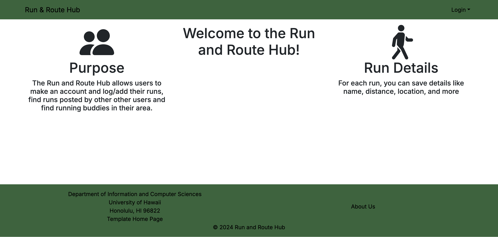
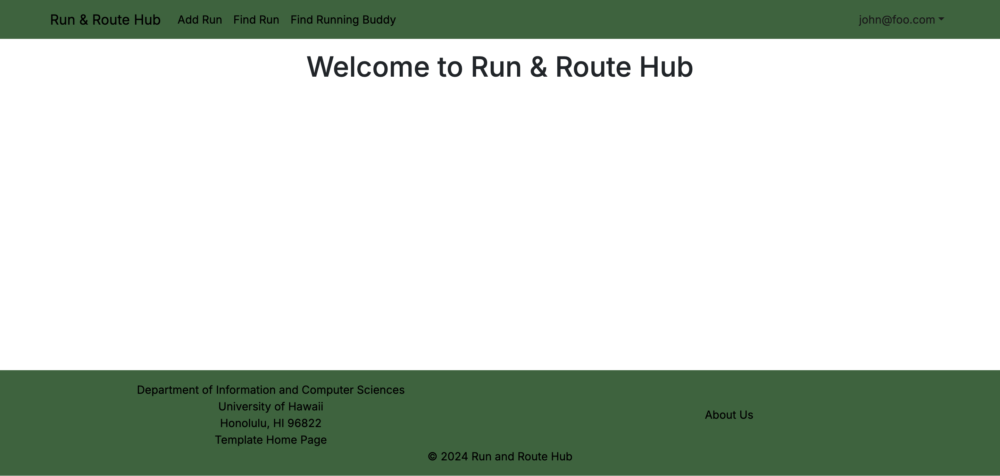

# Run & Route Hub

## Table of contents

* [Overview](#Overview)
* [Deployment](#Deployment)
* [Development](#Development)
* [Team](#Team)

## Overview

**Run & Route Hub** is a running-focused web app for UH students that helps runners:

- Find running partners based on pace and availability
- Access safe & UH-verified running routes
- Log runs and track progress
- View route difficulty scores (heat, slope, humidity, distance)
- Share safety feedback (lighting, crowds, sidewalks, water fountains)

This creates a **motivating and safety-focused running community** built specifically for UH students.

## Deployment

Project is not yet deployed to Vercel.

## Development

This is our landing page featuring a textblock layout with our "Welcome" in the center and to the left is our Page's purpose and to the right are the details of what each added run contains.

This is what the landing page looks like when signed in it shows our Navbar which has links to our Add Run Page, Find Run Page, and Find Running Buddies Page.

### Milestone 1
[Milestone 1](https://github.com/orgs/run-and-route-hub/projects/1/views/1) contains the plans and issues for the first initial steps of the project.

## Team

[Team Contract](https://docs.google.com/document/u/1/d/1DqhWxR_jaalQ27gvdDZRM-GbxYIpypTjjWOkkhnjlBU/edit?tab=t.0)

- [Renjie Chen](https://chenr24-ics.github.io/)
- [Albert Scales](https://albertlks.github.io/)
- [Shuwei Chen](https://shuwei0225.github.io/)
- [Jacob Hatanaka](https://jacob-hatanaka.github.io/)
- [Preston Woo](https://preston-woo.github.io/)
